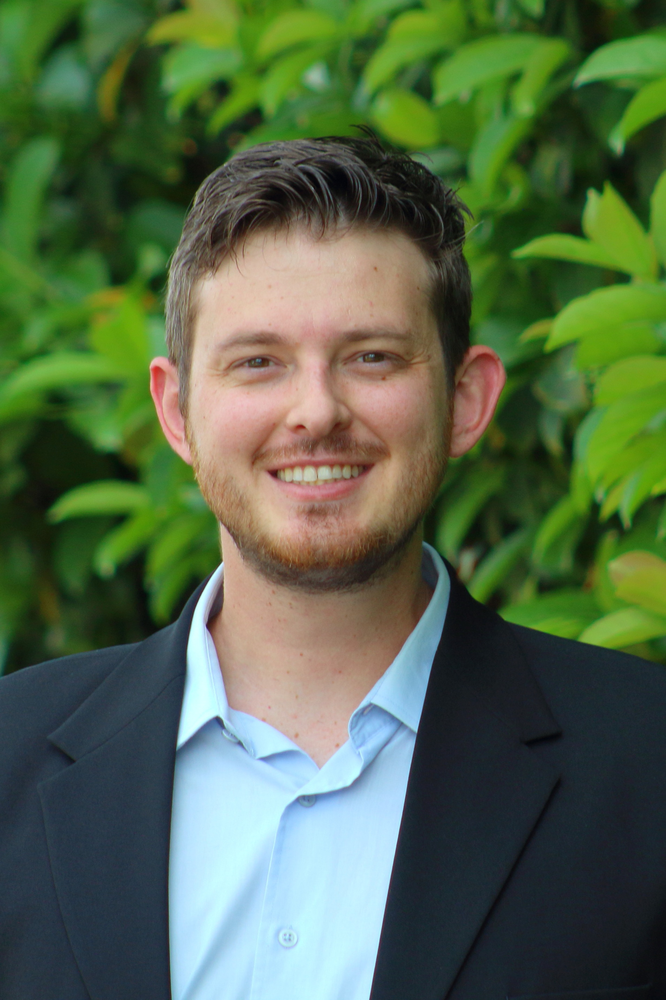

<link rel="stylesheet" href="styles.css" type="text/css">

I am proudly born and raised in the State of Rondônia in the Brazilian Amazon. There, I have helped manage my family's Ecolodge, and multiple times guided international tourist and scientists through the forest. This was my first contact with the academic realm, which made me realized that I would like to be "doing science" in the Amazon, help understand the Biome and conserve it. To pursue better education, I moved to south Brazil to attend the [Universidade do Extremo Sul Catarinense](http://www.unesc.net/portal/), where I got a B.S. in Environmental Engineering. During my final undergraduate project, I worked as an intern in a cassiterite mining company, analyzing water bodies in recovering degraded areas.
My first international adventure was to study English in the United States, and I ended up enrolled in the Master program of [Forest Resource and Conservation](http://sfrc.ufl.edu/) at the [University of Florida](http://www.ufl.edu/), also pursuing a certificate in [Tropical Conservation and Development](http://uftcd.org/).

My interests lay in technologies to understand trends in ecology, conservation and sustainable development of tropical forests, including remote sensing, GIS, data analysis and modeling.

My resume is available [here](files/Resume_Bongiolo_Academic.pdf).